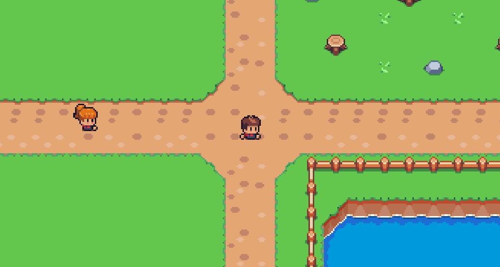

<h1 align="center">
    <a href="https://laravelcollective.com/tools/banner">
        
    </a>
</h1>

# 📝 Sunrise Village

<p align="center"> Game desevolvido para testar conhecimentos e mecanicas aprendidas com Unity e a linguagem de programação C#. </p>

## 📌 Índice
<p align="center">         
  <a href="#descrição"> Descrição </a> &nbsp; &nbsp; &nbsp; | &nbsp; &nbsp; &nbsp;  
  <a href="#tecnologias">Tecnologias </a> &nbsp; &nbsp; &nbsp; | &nbsp; &nbsp; &nbsp;        
  <a href="#instalação"> Instalação e Uso </a> &nbsp; &nbsp; &nbsp;
</p>          

## Descrição          

Status: Em desenvolvimento

Sunrise Village é um jogo no estilo Harvest Moon, onde a objetivo princípal é administar uma fazenda.

## Tecnologias                                


## ⚙ Instalação   

### Clonagem

Primeiro, clone o repositório para seu ambiente:

```bash
> git clone https://github.com/Gabrielrc11/sunrise_village.git
```

Depois, abra repositório clonado na sua Unity Hub.

-------------          

- [Voltar ao Início](#index)